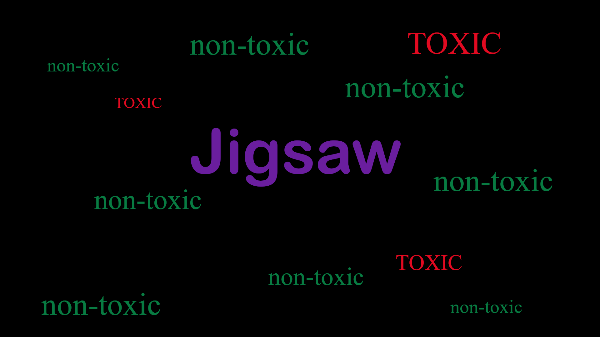

# Toxicity Classification in Multilingual Comment Texts Using Data Augmentation and Machine Learning

## Repository Link

https://github.com/C-B-001/Toxicity-Classification-in-Multilingual-Comment-Texts-Using-Data-Augmentation-and-Machine-Learning

## Description

The Project was to find solutions for the Kaggle competition "Jigsaw Multilingual Toxic Comment Classification". 
The training, evaluation and test datasets contain comment texts, which are classified as toxic or non-toxic. The training data is only in English. The evaluation and test data in multiple non-English languages. 

### Task Type

Text Classification

### Results Summary

- **Best Model:** XLM-RoBERTa
- **Evaluation Metric:** ROC-AUC
- **Result:** 91.16%

## Documentation

1. **[Literature Review](0_LiteratureReview/README.md)**
2. **[Dataset Characteristics](1_DatasetCharacteristics/exploratory_data_analysis.ipynb)**
3. **[Baseline Model](2_BaselineModel/baseline_model.ipynb)**
4. **[Model Definition and Evaluation](3_Model/model_definition_evaluation)**
5. **[Presentation](4_Presentation/README.md)**

## Cover Image

